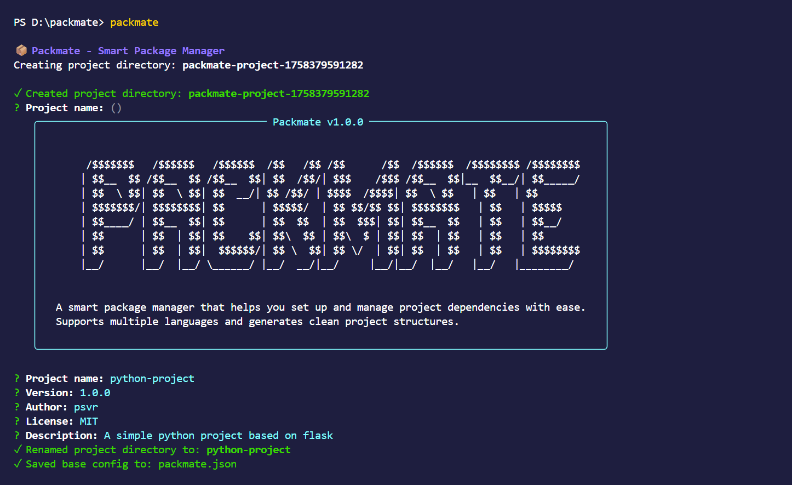

<div align="center">
  <h1>Packmate</h1>
  <h3>Your Intelligent Project Setup Companion</h3>
  
  <p>
    <em>Bootstrap your projects in seconds, not hours. Packmate automates the boring setup so you can focus on what matters - writing great code.</em>
  </p>

  <p>
    <a href="#-features">Features</a> •
    <a href="#-quick-start">Quick Start</a> •
    <a href="#-how-it-works">How It Works</a> •
    <a href="#-example-usage">Example</a> •
    <a href="#-roadmap">Roadmap</a>
  </p>
</div>

##  Demo

<div align="center">
  
  <p><em>Packmate in action!</em></p>  
</div>

##  Features

- **Multi-language Support** - Works with Node.js, Python, Java, and more
- **Smart Suggestions** - Get intelligent package recommendations
- **Zero Configuration** - Sensible defaults with full customization
- **Git Integration** - Optional Git repository initialization with .gitignore


##  Quick Start

Get started with Packmate in seconds:

```bash
# Clone the repo
git clone https://github.com/ps-vardhan/packmate.git
cd packmate

# Install dependencies
npm install

# Link globally to use the "packmate" command
npm link

# Now you can run
packmate
```

## 🛠 How It Works

### 1. Project Initialization
```bash
packmate
```

### 2. Interactive Setup
Answer a few simple questions about your project:
- Project type (Web, API, Library, etc.)
- Language and framework
- Project structure
- Additional features

### 3. Dependency Management
- Get smart package suggestions
- Add custom dependencies
- Automatic version resolution

### 4. Ready to Code!
- Clean project structure
- All configuration files generated
- Development server ready to go

## 📋 Example

### Creating a Flask Project
```bash
packmate init my-flask-app
```

**Packmate will:**
1. Set up a virtual environment
2. Install Flask and recommended packages
3. Create project structure
4. Generate requirements.txt
5. Initialize Git (optional)

## 🎯 Features in Detail

### Smart Package Suggestions
```
? Which packages would you like to install? (Press <space> to select, <a> to toggle all, <i> to invert)
❯◯ flask
 ◯ flask-sqlalchemy
 ◯ flask-login
 ◯ flask-wtf
 ◯ pytest
```

### Project Structure Generation
```
my-project/
├── app/
│   ├── __init__.py
│   ├── routes.py
│   └── models.py
├── tests/
├── requirements.txt
└── README.md
```

##  Why Choose Packmate?

- **Instant Setup** – Generate ready-to-code projects in seconds
- **Smart Dependency Management** – Auto-suggests the right libraries for your stack
- **Clean Project Structures** – Consistent, scalable, and industry-standard layouts
- **Multi-Language Support** – Works with Node.js, Python, Java, and more

##  Installation Options

### Global Installation
```bash
npm install -g packmate
```

### Local Project
```bash
npm install --save-dev packmate
```

### Using npx (No Installation Required)
```bash
npx packmate
```
